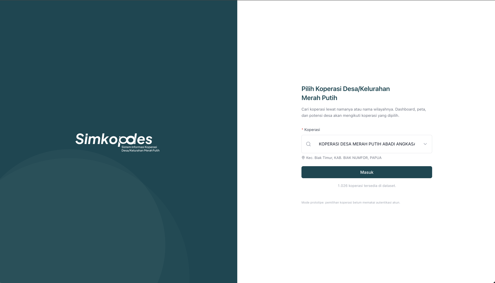
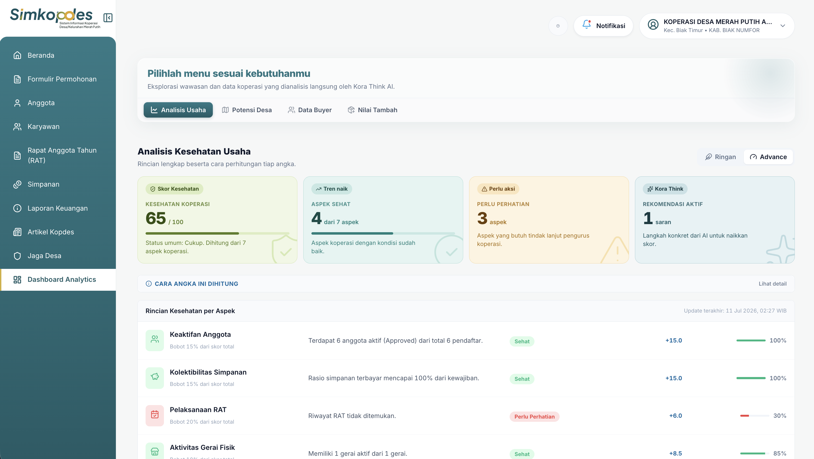
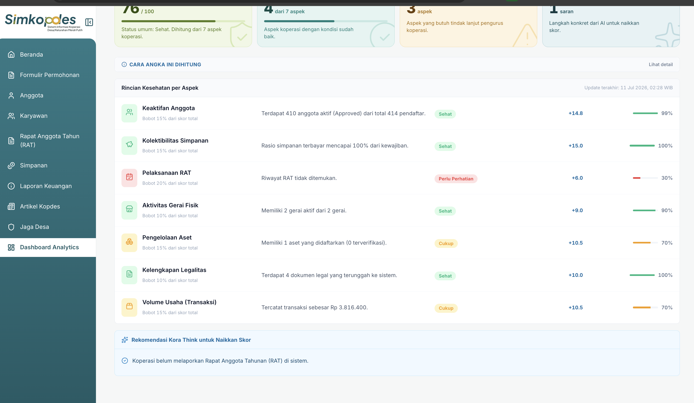
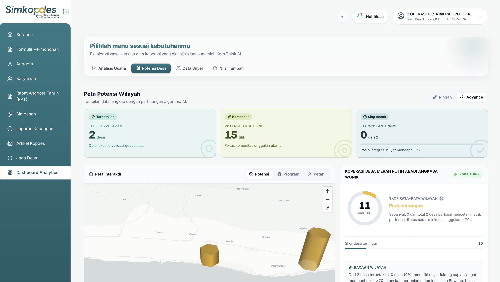
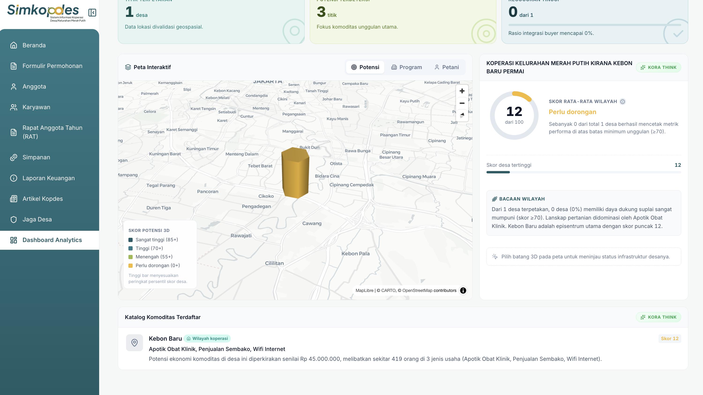
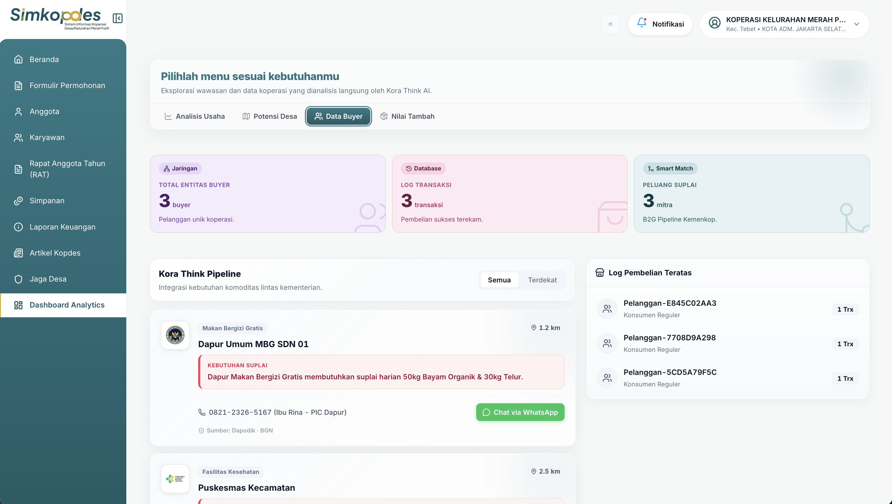
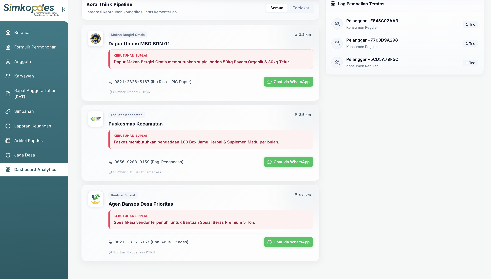
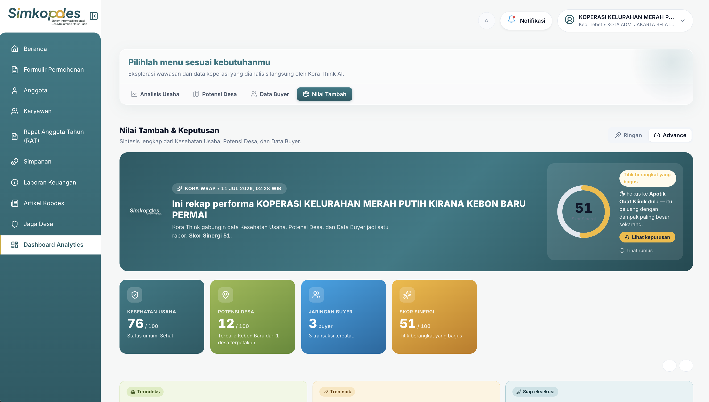
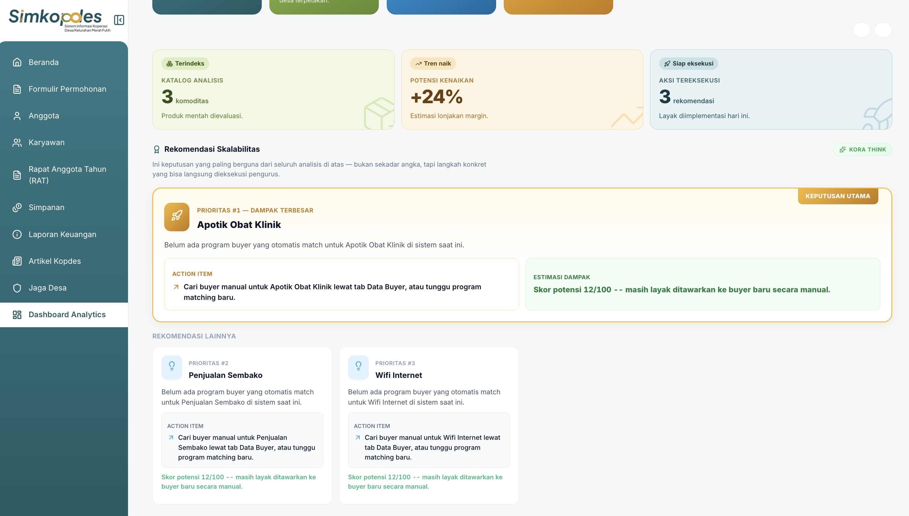
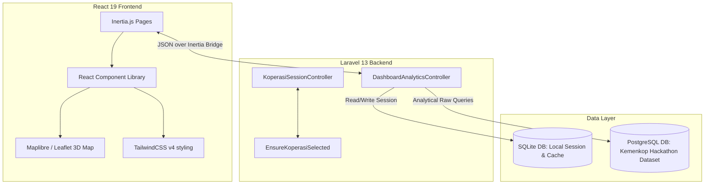

# 🇮🇩 Sikora (Simkopdes Analytics) — Dashboard & Decision-Support System

> **Empowering Indonesian Village Cooperatives (Koperasi Desa) through Multi-Agency Data Harmonization and AI-Driven B2G Market Synergy.**

[](https://laravel.com)
[](https://react.dev)
[](https://www.typescriptlang.org)
[](https://tailwindcss.com)
[](https://www.postgresql.org)

---

## 📌 Context & Problem Statement

Indonesian village cooperatives (*Koperasi Desa / Kelurahan*) are the foundational pillars of the rural economy. However, they frequently face hurdles that prevent them from scaling and integrating into larger economic ecosystems:
1. **Capital and Operational Health Blindspots**: Cooperatives struggle to gauge their internal health indicators against national standards, hindering their readiness for formal credit or state funding.
2. **Unmapped Agricultural Potential**: Natural village commodities and human resource pools are documented in fragmented databases, making it difficult for cooperatives to identify regional comparative advantages.
3. **B2G Procurement Data Silos**: Government programs (such as the *Makan Bergizi Gratis / MBG* national nutrition initiative, social welfare/bansos distribution, and healthcare supply programs) require substantial local products. Yet, local cooperatives lack direct access to demand pipelines, while government procurement offices struggle to identify qualified local cooperative suppliers.

---

## 💡 The Solution: Sikora (Simkopdes Analytics)

**Sikora** (Sistem Informasi Koperasi Desa) bridges these gaps by acting as an intelligent **Decision-Support System (DSS)** and **B2G matching gateway**. It processes data from the Ministry of Cooperatives (Kemenkop) and cross-references it against inter-ministerial databases (Dapodik, Kemenkes, Bappenas/DTKS) to enable:

*   📊 **Automated Health Diagnostics**: Calculates a weighted score (1-100) assessing cooperative viability based on 7 legal and operational criteria.
*   🗺️ **Interactive 3D Geospatial Mapping**: Renders national village commodity yields and human resources, highlighting regional strengths relative to the whole nation.
*   🤝 **Kora Think Pipeline (Smart Matching)**: Matches local cooperative supplies with live demand from public schools (MBG program), community clinics (Puskesmas), and social aid programs.
*   🚀 **Value-Added Hilirisasi Simulator**: Simulates processing raw commodities into higher-margin products and connects cooperatives directly to regional off-takers via pre-generated WhatsApp pitch messages.

---

## 📷 Platform Walkthrough & Features

### 1. Unified Authentication & Cooperative Selector
A gateway featuring zero-friction login for demonstration. It catalogs **1,026+ active village cooperatives** across Indonesia, immediately pulling historical metadata, local coordinates, and operational histories upon selection.



---

### 2. Business Health Diagnostics (*Analisis Kesehatan Usaha*)
Analyzes cooperative health across **7 core metrics** aligned with official ministerial frameworks:
*   **Keaktifan Anggota (15%)**: Ratio of approved/active members to total registrants.
*   **Kolektibilitas Simpanan (15%)**: Payment fulfillment rate for mandatory member savings.
*   **Pelaksanaan RAT (20%)**: Recency and compliance of Rapat Anggota Tahunan reporting.
*   **Aktivitas Gerai Fisik (10%)**: Number and status of active physical storefronts.
*   **Pengelolaan Aset (15%)**: Volume of registered and verified cooperative assets.
*   **Kelengkapan Legalitas (10%)**: Compliance verification of uploaded legal licensing documents.
*   **Volume Usaha / Transaksi (15%)**: Cumulative sales revenue and transaction count.

*Kora Think AI* translates these scores into actionable operational improvements (e.g. flagging unpaid dues, recommending RAT schedules, or legal document uploads).



*The dashboard provides a detailed, granular breakdown of all 7 health indicators, accompanied by direct actionable insights from the Kora Think recommendation engine:*




---

### 3. Geospatial Potential Mapping (*Peta Potensi Wilayah*)
An interactive 3D map plotting neighboring villages. It displays:
*   **Commodity Volume & SDM Involvement**: Pinpoints coordinates where agricultural yields are highest.
*   **National Percent Rank Scoring**: Scores village potentials from 1-100 relative to all villages nationwide.
*   **Geospatial Clustering**: Visualizes nearby cooperatives to prevent overlapping operational areas.



*Cooperatives can drill down into individual villages on the map to view cataloged local commodities, active SDM involvement statistics, and total economic potential valuations:*




---

### 4. Smart Matching Buyer (*Data Buyer & Matching*)
Connects cooperative inventories with regional institutional demand. *Kora Think Pipeline* matches categories dynamically:
*   🍱 **Makan Bergizi Gratis (MBG)**: Connects farms to nearby school kitchens needing ingredients (e.g., spinach, eggs).
*   🌿 **Kesehatan**: Links herbal producers (e.g., ginger, honey) to local clinics.
*   📦 **Bansos (Social Aid)**: Matches rice, sugar, and staples to regional distribution agencies.

Provides direct **WhatsApp integration** containing pre-filled, formal supply proposals listing matching commodities, volumes, and PIC contact information.



*Each matched buyer includes contact information, the source program, and a button to initiate a direct pre-filled WhatsApp proposal pitch tailored to that buyer's requirements:*




---

### 5. Synergy & Hilirisasi Dashboard (*Nilai Tambah & Keputusan*)
A holistic wrap-up featuring **Skor Sinergi** (a compound metric of health, regional potential, and buyer integration). It offers:
*   **Actionable Value-Add Strategies**: Recommends processing strategies (e.g., packaging raw goods) to fit specific buyer requirements.
*   **Proximity & Volume Analysis**: Outlines distances (km) and supply feasibility to minimize logistics overhead.



*Scroll down to view scalability recommendations prioritizing the highest-impact expansion ventures with computed risk-reward estimates:*




## 🧠 Smart Decision-Support System & Engine Logic (Kora Think)

Sikora's intelligence is powered by **Kora Think**, a deterministic **Rule-Based Expert System (Symbolic AI)** and **Decision-Support System (DSS)**. Rather than relying on non-deterministic generative models which are prone to hallucinations, Kora Think uses mathematical models, statistical indexing, and keyword token-matching to provide transparent, auditable, and instant decisions.

### 1. Weighted Multi-Criteria Business Health Scoring
Kora Think evaluates cooperative viability across 7 operational pillars. The overall health score is a weighted sum:

$$\text{Health Score} = \sum_{i=1}^{7} (\text{Score}_i \times \text{Weight}_i)$$

Where the dimensions are defined as:
*   **Keaktifan Anggota ($15\%$)**: Active member ratio.
*   **Kolektibilitas Simpanan ($15\%$)**: Savings payment rate.
*   **Pelaksanaan RAT ($20\%$)**: Reporting compliance based on recency ($S_{\text{RAT}} = 100$ if $\le 1$ year, $70$ for $2$ years, $30$ otherwise).
*   **Aktivitas Gerai ($10\%$)**: Number of active physical outlets.
*   **Pengelolaan Aset ($15\%$)**: Verified asset ratio.
*   **Kelengkapan Legalitas ($10\%$)**: Count of legally compliant documents uploaded.
*   **Volume Usaha ($15\%$)**: Transaction frequencies and sales volume.

The expert system matches these scores to direct recommendation strings (e.g. suggesting urgent member approval processes if Keaktifan Anggota drops below $60\%$).

### 2. Statistical Potential Pemeringkatan Desa
To avoid arbitrary labeling of village economic potential, Kora Think computes the relative potential of a village against all villages nationwide using a statistical percentile rank over the commodity yields dataset:

$$\text{Percentile Rank} = \frac{\text{Rank} - 1}{N - 1} \times 100$$

*   Where $\text{Rank}$ is the rank of the target village ordered by total potential value, and $N$ is the total number of villages in Indonesia.
*   This score ($1-100$) classifies villages into dynamic categories: **Sangat Tinggi ($85+$)**, **Tinggi ($70+$)**, **Menengah ($55+$)**, and **Perlu Dorongan ($<55$)**.

### 3. Keyword Token-Based Smart Matching
The B2G matching pipeline cross-references raw cooperative inventory list $I$ against national procurement databases $D$:
*   It extracts the first nominal word token $T_i$ from each cooperative commodity (e.g., `"Bayam"` from `"Bayam Organik"`).
*   It executes a substring intersection search over the procurement databases (Dapodik/BGN, SatuSehat, DTKS).
*   If $T_i \cap D_j \neq \emptyset$, the system flags a match and formats a pre-filled pitch template, automating communication overhead.

---

## 🛠️ Technical Architecture



### Tech Stack Details
*   **Backend Framework**: [Laravel 13.x](https://laravel.com) running on PHP 8.3+.
*   **Frontend Library**: [React 19.x](https://react.dev) with [TypeScript](https://www.typescriptlang.org).
*   **Rendering Bridge**: [Inertia.js v3.x](https://inertiajs.com) (single-page application feel with server-driven routing).
*   **Styling**: [Tailwind CSS v4.0](https://tailwindcss.com) (Vite-native compiler).
*   **Databases**:
    *   **SQLite**: Local application cache, session validation, and prototype state.
    *   **PostgreSQL**: Cloud hosting for the Kemenkop database, handling queries across millions of rows of national cooperative data.

---

## 🗄️ Database Integration

Sikora operates on top of the **Kemenkop Hackathon Dataset (PostgreSQL)**, integrating multiple complex tables to formulate insights:

| Table Name | Description | Key Fields Used |
| :--- | :--- | :--- |
| `profil_koperasi` | Master list of all registered cooperatives. | `koperasi_ref`, `nama_koperasi`, `koordinat_dibulatkan` |
| `referensi_koperasi_wilayah` | Maps cooperatives to their operational villages. | `koperasi_ref`, `kode_wilayah` |
| `referensi_wilayah` | National census directory of administrative regions. | `kode_wilayah`, `desa_kelurahan`, `kecamatan`, `kab_kota`, `provinsi` |
| `referensi_komoditas_desa` | Commodity statistics per village. | `kode_wilayah`, `nama_komoditas`, `nilai_potensi_desa`, `jumlah_sdm_terlibat` |
| `transaksi_penjualan` | Sales records for transaction volume scoring. | `koperasi_ref`, `nama_pelanggan`, `total_pembayaran` |
| `anggota_koperasi` | Cooperative members roster. | `koperasi_ref`, `status_keanggotaan` |
| `simpanan_anggota` | Savings payment statuses. | `koperasi_ref`, `jumlah_simpanan`, `status` (`paid`/`unpaid`) |
| `rat_koperasi` | Rapat Anggota Tahunan registry. | `koperasi_ref`, `tahun_buku` |
| `gerai_koperasi` | Registered retail storefronts. | `koperasi_ref`, `status_gerai` |
| `aset_koperasi` | Asset registers for collateral validation. | `koperasi_ref`, `status` (`terverifikasi`) |
| `dokumen_koperasi` | Compliance and legal documents. | `koperasi_ref`, `nama_dokumen` |

---

## 🚀 Installation & Local Setup

Get the project running locally in less than 3 minutes.

### Prerequisites
*   PHP &geq; 8.3
*   Composer
*   Node.js (v18 or higher) & npm

### Step-by-Step Setup

1.  **Clone the Repository**
    ```bash
    git clone https://github.com/aarieffawwaz/hackathon-simkopdes-dashboard-analytics.git
    cd hackathon-simkopdes-dashboard-analytics
    ```

2.  **Run the Unified Setup Command**
    This automates dependency installations (Composer & npm), generates encryption keys, initializes the local SQLite database, runs migrations, and builds frontend assets:
    ```bash
    composer run setup
    ```

3.  **Start Development Environment**
    Starts the Laravel application server and the Vite asset server concurrently:
    ```bash
    composer run dev
    ```

4.  **Open the Application**
    Visit `http://localhost:8000` in your web browser.

---

## 👨‍💻 Developed By

Built with passion for the **Kemenkop Cooperative Hackathon**.
*   **Developers**: Arfiansyah & Aarief ([@aarieffawwaz](https://github.com/aarieffawwaz))
*   **Deployment**: [smart-dashboard-analytics.my.id](https://smart-dashboard-analytics.my.id)
